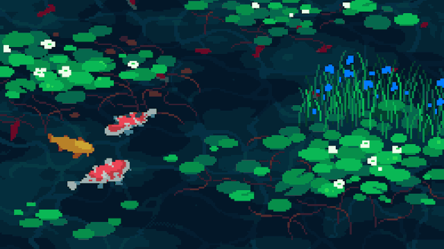

    

<h1 align="center">Hi 👋, I'm Filip</h1>
<h3 align="center">Technology enthusiast based in Warsaw</h3>
    

* 🌱 I’m currently doing a Master's degree in **Machine Learning and Data Science!**

* 📫Reach out to me at **filipschulz1@gmail.com**

## Languages and Tools :computer:

 
 
  
 
 
  
  
 
 
  
  
 
 
 
 
  
 
 
 

 

## Some stats :bar_chart:

&nbsp;

